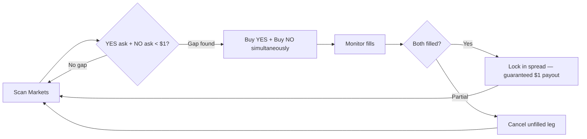
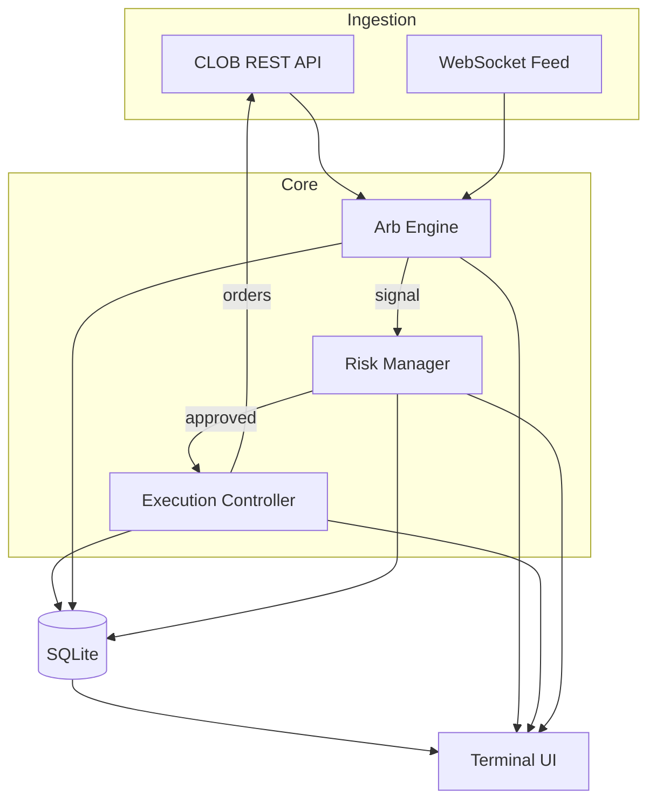

<div align="center">

```
  _  _ _  _ ___ ___
 | || | || / __| __|
  \_, | \\_,\__ \ _|
  |__/ \__/|___/___|
```

# Yuga


**Polymarket YES/NO arbitrage bot with live TUI.**
Scans order books. Buys both sides under $1. Collects the spread.

</div>

---

## Quick Start

```bash
python -m venv .venv && source .venv/bin/activate
pip install -r requirements.txt
cp .env.example .env   # add your CLOB API keys
```

```bash
python main.py                # live TUI dashboard
python main.py --dry-run      # observe only (starts paused)
python main.py --headless     # daemon mode, logs to stdout
```

## How It Works



In a binary market, `ask(YES) + ask(NO)` should equal `$1.00`. When it's less, buy both sides for a risk-free profit at resolution. The bot also detects reverse arbs where `bid(YES) + bid(NO) > $1.00`.

## Architecture



## TUI

Keys: `p` pause/resume &middot; `c` cancel all &middot; `r` reload config &middot; `s` status &middot; `q` quit

Commands in the input bar: `pause` `resume` `cancel-all` `reload` `status` `reset-cb` `quit`

| Panel | What it shows |
|-------|--------------|
| **Metrics Bar** | WS/CLOB connection health, latency, uptime |
| **Market Scanner** | Tracked markets, YES/NO bid/ask, combined ask sum, active signals |
| **Order Feed** | Live orders with fill status, latency, age |
| **Positions & Risk** | PnL, fill rate, circuit breaker state, exposure limits |
| **PnL Chart** | Sparkline of cumulative PnL |
| **Pipeline** | SCANNING → SNAPSHOT → CANDIDATE → PLACING → MONITORING → RESOLVING |

## Risk Controls

Circuit breakers trip automatically on daily loss limits or consecutive losses, then auto-reset after cooldown. All thresholds configurable in `config.yaml`.

## State

All state lives in `yuga.db` (SQLite). Kill and restart anytime — the bot picks up where it left off.

## Remote Monitoring

```bash
tmux new -s yuga && python main.py    # detach with Ctrl+B, D
tmux attach -t yuga                    # reattach later
```
