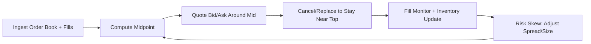
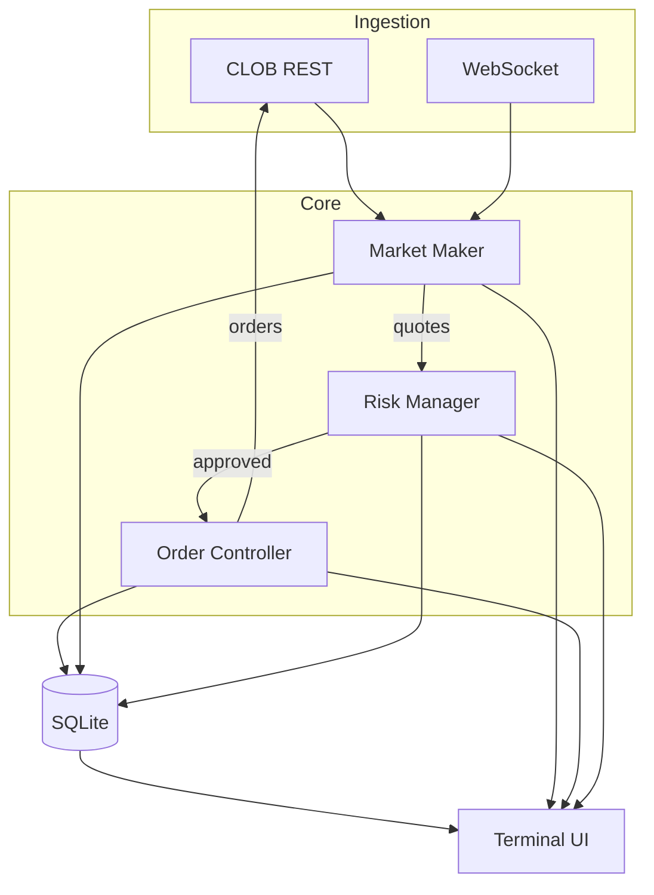

<div align="center">

```
⠀⠀⠀⠀⠀  ⢠⣿⣿⣦⠀⠀⠀⠀⠀⠀⠀⠀⠀⢀⣴⣿⣦⡀⠀⠀⠀⠀⠀⠀⠀
⠀⠀⠀⠀⠀⠀⢠⣿⣿⣿⣿⣆⠀⠀⠀⠀⠀⠀⠀⠀⣾⣿⣿⣿⣷⠀⠀⠀⠀⠀⠀⠀
⠀⠀⠀⠀⠀⢀⣾⣿⣿⣿⣿⣿⡆⠀⠀⠀⠀⠀⠀⣸⣿⣿⣿⣿⣿⡆⠀⠀⠀⠀⠀⠀
⠀⠀⠀⠀⠀⣾⣿⣿⣿⣿⣿⣿⣿⡀⠀⠀⠀⠀⢀⣿⣿⣿⣿⣿⣿⣿⠀⠀⠀⠀⠀⠀
⠀⠀⠀⠀⢸⣿⣿⣿⣿⣿⣿⣿⣿⣧⠀⠀⠀⠀⣼⣿⣿⣿⣿⣿⣿⣿⡇⠀⠀⠀⠀⠀
⠀⠀⠀⠀⣿⣿⣿⣿⣿⣿⣿⣿⣿⣿⣠⣤⣤⣼⣿⣿⣿⣿⣿⣿⣿⣿⣷⠀⠀⠀⠀⠀
⠀⠀⠀⢀⣿⣿⣿⣿⣿⣿⣿⣿⣿⣿⣿⣿⣿⣿⣿⣿⣿⣿⣿⣿⣿⣿⣿⠀⠀⠀⠀⠀
⠀⠀⠀⢸⣿⣿⣿⣿⣿⣿⣿⣿⣿⣿⣿⣿⣿⣿⣿⣿⣿⣿⣿⣿⣿⣿⣿⠀⠀⠀⠀⠀
⠀⠀⠀⠘⣿⣿⣿⣿⠟⠁⠀⠀⠀⠹⣿⣿⣿⣿⣿⠟⠁⠀⠀⠹⣿⣿⣿⠇⠀⠀⠀⠀
⠀⠀⠀⠀⣿⣿⣿⡇⠀⠀⠀⢼⣿⠀⢿⣿⣿⣿⣿⠀⣾⣷⠀⠀⢿⣿⣿⣿⠀⠀⠀⠀
⠀⠀⠀⢠⣿⣿⣿⣷⡀⠀⠀⠈⠋⢀⣿⣿⣿⣿⣿⡀⠙⠋⠀⢀⣾⣿⣿⡇⠀⠀⠀⠀
⢀⣀⣀⣀⣿⣿⣿⣿⣿⣶⣶⣶⣶⣿⣿⣿⣿⣾⣿⣷⣦⣤⣴⣿⣿⣿⣿⣤⠤⢤⣤⡄
⠈⠉⠉⢉⣙⣿⣿⣿⣿⣿⣿⣿⣿⣿⣿⣿⣿⣿⣿⣿⣿⣿⣿⣿⣿⣿⣇⣀⣀⣀⡀⠀
⠐⠚⠋⠉⢀⣬⡿⢿⣿⣿⣿⣿⣿⣿⣿⣿⣿⣿⣿⣿⣿⣿⣿⣿⡿⣥⣀⡀⠈⠀⠈⠛
⠀⠀⠴⠚⠉⠀⠀⠀⠉⠛⣿⣿⣿⣿⣿⣿⣿⣿⣿⣿⡿⠛⠋⠁⠀⠀⠀⠉⠛⠢⠀⠀
⠀⠀⠀⠀⠀⠀⠀⠀⠀⣸⣿⣿⣿⣿⣿⣿⣿⣿⣿⣿⡇⠀⠀⠀⠀⠀⠀⠀⠀⠀⠀⠀
⠀⠀⠀⠀⠀⠀⠀⠀⣰⣿⣿⣿⣿⣿⣿⣿⣿⣿⣿⣿⣧⠀⠀⠀⠀⠀⠀⠀⠀⠀⠀⠀
⠀⠀⠀⠀⠀⠀⠀⢠⣿⣿⣿⣿⣿⣿⣿⣿⣿⣿⣿⣿⣿⡀⠀⠀⠀⠀⠀⠀⠀⠀⠀⠀
⠀⠀⠀⠀⠀⠀
```

# Yuga

**Polymarket market-making + liquidity-provision bot with live TUI.**

</div>

---

## Quick Start

```bash
python -m venv .venv && source .venv/bin/activate
pip install -r requirements.txt
cp .env.example .env   # add your CLOB API keys
```

```bash
python main.py                # live TUI dashboard
python main.py --dry-run      # observe only (starts paused)
python main.py --headless     # daemon mode, logs to stdout
```

## Flow



## Architecture



## TUI

Keys: `p` pause/resume &middot; `c` cancel all &middot; `r` reload config &middot; `s` status &middot; `q` quit

Commands in the input bar: `pause` `resume` `cancel-all` `reload` `status` `reset-cb` `quit`

Minimal panels: order book, active quotes, inventory skew, spreads, fills, rewards, health/latency.

## State

All state lives in `yuga.db` (SQLite). Kill and restart anytime — the bot picks up where it left off.

## Remote Monitoring

```bash
tmux new -s yuga && python main.py    # detach with Ctrl+B, D
tmux attach -t yuga                    # reattach later
```
