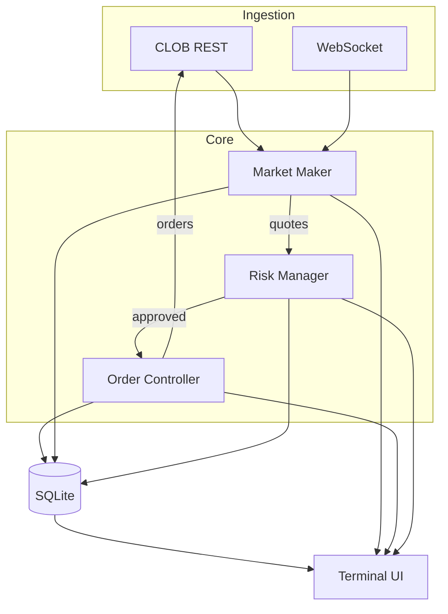

<div align="center">

```
⠀⠀⠀⠀⠀  ⢠⣿⣿⣦⠀⠀⠀⠀⠀⠀⠀⠀⠀⢀⣴⣿⣦⡀⠀⠀⠀⠀⠀⠀⠀
⠀⠀⠀⠀⠀⠀⢠⣿⣿⣿⣿⣆⠀⠀⠀⠀⠀⠀⠀⠀⣾⣿⣿⣿⣷⠀⠀⠀⠀⠀⠀⠀
⠀⠀⠀⠀⠀⢀⣾⣿⣿⣿⣿⣿⡆⠀⠀⠀⠀⠀⠀⣸⣿⣿⣿⣿⣿⡆⠀⠀⠀⠀⠀⠀
⠀⠀⠀⠀⠀⣾⣿⣿⣿⣿⣿⣿⣿⡀⠀⠀⠀⠀⢀⣿⣿⣿⣿⣿⣿⣿⠀⠀⠀⠀⠀⠀
⠀⠀⠀⠀⢸⣿⣿⣿⣿⣿⣿⣿⣿⣧⠀⠀⠀⠀⣼⣿⣿⣿⣿⣿⣿⣿⡇⠀⠀⠀⠀⠀
⠀⠀⠀⠀⣿⣿⣿⣿⣿⣿⣿⣿⣿⣿⣠⣤⣤⣼⣿⣿⣿⣿⣿⣿⣿⣿⣷⠀⠀⠀⠀⠀
⠀⠀⠀⢀⣿⣿⣿⣿⣿⣿⣿⣿⣿⣿⣿⣿⣿⣿⣿⣿⣿⣿⣿⣿⣿⣿⣿⠀⠀⠀⠀⠀
⠀⠀⠀⢸⣿⣿⣿⣿⣿⣿⣿⣿⣿⣿⣿⣿⣿⣿⣿⣿⣿⣿⣿⣿⣿⣿⣿⠀⠀⠀⠀⠀
⠀⠀⠀⠘⣿⣿⣿⣿⠟⠁⠀⠀⠀⠹⣿⣿⣿⣿⣿⠟⠁⠀⠀⠹⣿⣿⣿⠇⠀⠀⠀⠀
⠀⠀⠀⠀⣿⣿⣿⡇⠀⠀⠀⢼⣿⠀⢿⣿⣿⣿⣿⠀⣾⣷⠀⠀⢿⣿⣿⣿⠀⠀⠀⠀
⠀⠀⠀⢠⣿⣿⣿⣷⡀⠀⠀⠈⠋⢀⣿⣿⣿⣿⣿⡀⠙⠋⠀⢀⣾⣿⣿⡇⠀⠀⠀⠀
⢀⣀⣀⣀⣿⣿⣿⣿⣿⣶⣶⣶⣶⣿⣿⣿⣿⣾⣿⣷⣦⣤⣴⣿⣿⣿⣿⣤⠤⢤⣤⡄
⠈⠉⠉⢉⣙⣿⣿⣿⣿⣿⣿⣿⣿⣿⣿⣿⣿⣿⣿⣿⣿⣿⣿⣿⣿⣿⣇⣀⣀⣀⡀⠀
⠐⠚⠋⠉⢀⣬⡿⢿⣿⣿⣿⣿⣿⣿⣿⣿⣿⣿⣿⣿⣿⣿⣿⣿⡿⣥⣀⡀⠈⠀⠈⠛
⠀⠀⠴⠚⠉⠀⠀⠀⠉⠛⣿⣿⣿⣿⣿⣿⣿⣿⣿⣿⡿⠛⠋⠁⠀⠀⠀⠉⠛⠢⠀⠀
⠀⠀⠀⠀⠀⠀⠀⠀⠀⣸⣿⣿⣿⣿⣿⣿⣿⣿⣿⣿⡇⠀⠀⠀⠀⠀⠀⠀⠀⠀⠀⠀
⠀⠀⠀⠀⠀⠀⠀⠀⣰⣿⣿⣿⣿⣿⣿⣿⣿⣿⣿⣿⣧⠀⠀⠀⠀⠀⠀⠀⠀⠀⠀⠀
⠀⠀⠀⠀⠀⠀⠀⢠⣿⣿⣿⣿⣿⣿⣿⣿⣿⣿⣿⣿⣿⡀⠀⠀⠀⠀⠀⠀⠀⠀⠀⠀
⠀⠀⠀⠀⠀⠀
```

# Yuga

**Polymarket market-making + liquidity-provision bot with live TUI.**

</div>

---

## Quick Start

```bash
python -m venv .venv && source .venv/bin/activate
pip install -r requirements.txt
cp .env.example .env   # add your CLOB API keys
```

```bash
python main.py                # live TUI dashboard
python main.py --dry-run      # observe only (starts paused)
python main.py --headless     # daemon mode, logs to stdout
```

## Runtime Modes

- `python main.py`: full TUI + live quoting
- `python main.py --dry-run`: no live orders, starts paused for safe observation
- `python main.py --headless`: no TUI, logs only

## Architecture



## TUI Controls

Keys: `p` pause/resume &middot; `c` cancel all &middot; `r` reload config &middot; `s` status &middot; `[` / `]` prev/next book &middot; `o` toggle book auto-rotate &middot; `q` quit

Commands: `pause` `resume` `cancel-all` `reload` `status` `next-book` `prev-book` `book-auto` `book-auto-on` `book-auto-off` `reset-cb` `quit`

Panels: order book, market scanner, orders, positions, odds history, pnl, pipeline.

## State

State is stored in `yuga.db` (SQLite). You can restart anytime; state is reloaded on startup.

## Remote Monitoring

```bash
tmux new -s yuga && python main.py    # detach with Ctrl+B, D
tmux attach -t yuga                    # reattach later
```
